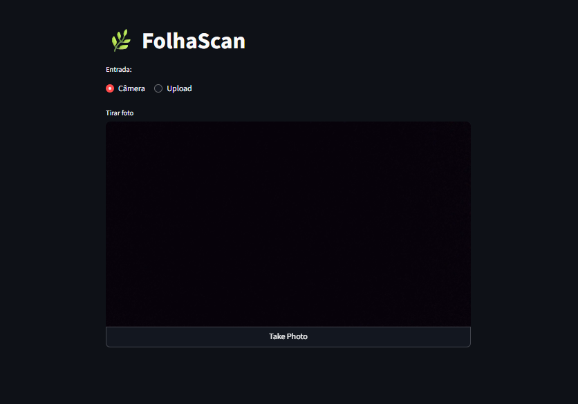
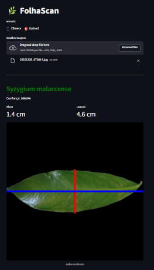
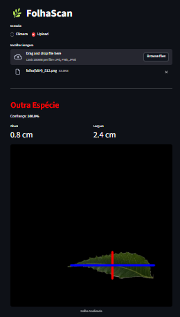

# FolhaScan 🌿
Sistema de **segmentação, classificação e medição morfométrica** de folhas com Processamento Digital de Imagens (PDI) e Machine Learning.

> Projeto desenvolvido para a disciplina **TAD0018 - Processamento Digital de Imagens (UFRN)**.

---

## Sumário
- [Visão geral](#visão-geral)
- [Como funciona](#como-funciona)
- [Pipeline do processamento](#pipeline-do-processamento)
- [Tecnologias](#tecnologias)
- [Resultados](#resultados)
- [Prints](#prints)

---

## Visão geral
O **FolhaScan** é uma aplicação (web) que recebe uma imagem de folha (via **upload** ou **câmera do navegador**) e realiza:

- **Segmentação**: isola a folha do fundo.
- **Classificação**: indica se a folha é *Syzygium malaccense* ou **Outra Espécie**, com **confiança (%)**.
- **Medição**: calcula **altura** e **largura** e desenha linhas-guia sobre a imagem.

A interface é feita em **Streamlit**, permitindo uso em **PC e celular** diretamente pelo navegador.

---

## Como funciona
O sistema executa um pipeline em sequência:

1. O usuário envia/captura uma imagem.
2. A aplicação converte a imagem para formato adequado (matriz NumPy / OpenCV).
3. Um algoritmo de **segmentação** gera a máscara binária da folha.
4. O sistema extrai **características** da folha segmentada.
5. Um modelo de **Machine Learning** faz a inferência (classe + probabilidade).
6. Caso exista uma folha válida, o sistema estima **largura** e **altura** e desenha as medições na imagem.
7. A interface exibe resultado final (classe, confiança, medidas e imagem processada).

---

## Pipeline do processamento

### 1) Entrada (Upload / Câmera)
A imagem chega ao sistema via:
- `st.file_uploader` (upload)
- `st.camera_input` (captura)

A imagem é convertida para array (OpenCV/NumPy) para permitir processamento.

### 2) Segmentação (PDI)
Objetivo: separar folha do fundo.

Exemplo de etapas comuns do método:
- Conversão de cor (ex: BGR → HSV)
- Limiarização (threshold) para destacar a folha
- Operações morfológicas (abertura/fechamento) para reduzir ruído
- Seleção do maior contorno (folha) para obter a máscara final

Saída: **máscara binária** e contorno da folha.

### 3) Extração de características (features)
A partir da máscara/folha segmentada, o sistema extrai descritores numéricos para alimentar o modelo.

Exemplos de descritores usados:
- **Forma**: Momentos de Hu (invariantes a rotação/escala)
- **Cor**: estatísticas (média) em HSV na região da folha

Saída: vetor de características (ex: 10 features).

### 4) Classificação (Machine Learning)
O vetor de características é passado para um modelo treinado previamente (ex: **Random Forest**).

O modelo retorna:
- **Classe prevista**: `Syzygium malaccense` ou `Outra Espécie`
- **Confiança**: probabilidade (0–100%)

### 5) Medição e visualização
Com a folha segmentada:
- Calcula-se um retângulo envolvente (bounding box) e/ou orientação
- Estima-se **altura** e **largura**
- Desenha-se na imagem:  
  - linha **vermelha** (altura)  
  - linha **azul** (largura)

A interface exibe as medidas em centímetros (quando aplicável/calibrado).

---

## Tecnologias
- **Python 3**
- **Streamlit** (interface web)
- **OpenCV** (processamento de imagens)
- **NumPy** (operações numéricas)
- **scikit-learn** (treinamento/inferência do modelo)

---
## Resultados
- Segmentação e classificação funcionando em testes do projeto.
- O sistema diferencia bem “folha alvo” vs “não folha / outra espécie”.
- Medição visual validada com sobreposição de linhas (altura/largura).

---
## Prints

<table>
  <tr>
    <td align="center" width="33%">
      <b>Tela inicial</b> 
      
    </td>
    <td align="center" width="33%">
      <b>Syzygium malaccense</b> 
      
    </td>
    <td align="center" width="33%">
      <b>Outra espécie</b> 
      
    </td>
  </tr>
</table>

Da esquerda para a direita: Tela inicial • Resultado (Syzygium malaccense) • Resultado (Outra espécie)

